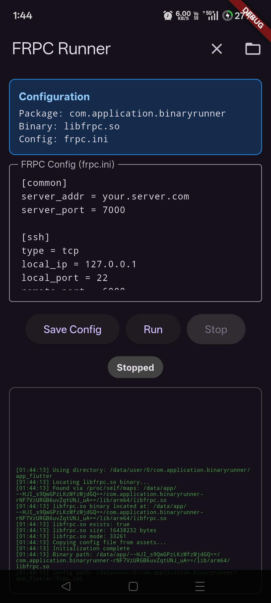

# Flutter Binary Executor

A Flutter app skeleton for running native binaries on Android devices. This app provides a generic framework that can be configured to execute any binary with custom configuration files and command-line arguments.



## Features

-  Execute native binaries on Android
-  Built-in configuration file editor
-  Real-time log output
-  Process management (start/stop)
-  Automatic binary discovery
-  Permission and file system diagnostics
-  Dark theme UI with status indicators

## Use Cases

This skeleton can be adapted for various purposes:
- Network tools (VPN clients, proxies, tunnels)
- System utilities
- Custom servers or daemons
- Command-line applications with GUI wrapper
- Development and testing tools

## Project Structure

```
your_flutter_project/
├── lib/
│   └── main.dart                    # Main application code
├── assets/
│   └── your_config.ini              # Your configuration file
└── android/
    └── app/
        └── src/
            └── main/
                └── jniLibs/
                    ├── arm64-v8a/
                    │   └── libyourbinary.so
                    ├── armeabi-v7a/
                    │   └── libyourbinary.so
                    └── x86_64/
                        └── libyourbinary.so
```

## Configuration

### 1. Binary Files Setup

Place your native binaries in the appropriate architecture folders:

```
android/app/src/main/jniLibs/
├── arm64-v8a/          # 64-bit ARM (most modern devices)
├── armeabi-v7a/        # 32-bit ARM (older devices)
├── x86/                # 32-bit x86 (emulators)
└── x86_64/             # 64-bit x86 (emulators)
```

**Important Notes:**
- Binaries must be named with `.so` extension (e.g., `libyourbinary.so`)
- Include binaries for all target architectures
- Ensure binaries are compiled for Android with appropriate API level

### 2. Configuration File

Create your configuration file in the `assets/` folder:

```
assets/
└── your_config.ini     # Your app's configuration file
```

### 3. Code Configuration

Modify the configuration section in `lib/main.dart`:

```dart
// =============================================================================
// CONFIGURATION SECTION - Modify these variables for your specific use case
// =============================================================================

// Name of the binary file to execute (must match file in jniLibs)
static const String binaryFileName = 'libyourbinary.so';

// Name of the config file in assets and app documents
static const String configFileName = 'your_config.ini';

// Command line arguments template (use {configPath} placeholder)
static const List<String> commandArguments = ['-c', '{configPath}'];

// Display name for UI
static const String appDisplayName = 'Your App Name';
```

### 4. Assets Declaration

Add your config file to `pubspec.yaml`:

```yaml
flutter:
  assets:
    - assets/your_config.ini
```

## How It Works

### Binary Discovery
1. Reads `/proc/self/maps` to find loaded libraries
2. Searches for your package name and `.so` files
3. Locates the target binary in the appropriate architecture folder

### Configuration Management
1. Copies config file from assets to app documents directory on first run
2. Provides in-app editor for configuration changes
3. Saves changes persistently to the device

### Process Execution
1. Builds command line arguments with config file path
2. Starts binary as a separate process
3. Captures stdout/stderr for logging
4. Provides process lifecycle management

## Installation & Setup

### Prerequisites
- Flutter SDK
- Android development environment
- Native binaries compiled for Android

### Steps

1. **Clone or create your project:**
   ```bash
   flutter create your_binary_app
   cd your_binary_app
   ```

2. **Add dependencies to `pubspec.yaml`:**
   ```yaml
   dependencies:
     flutter:
       sdk: flutter
     path_provider: ^2.1.1
     package_info_plus: ^4.2.0
   ```

3. **Replace `lib/main.dart` with the provided code**

4. **Configure the app** (see Configuration section above)

5. **Add your binaries** to `android/app/src/main/jniLibs/`

6. **Add your config file** to `assets/`

7. **Update `pubspec.yaml`** to include assets

8. **Build and run:**
   ```bash
   flutter run
   ```

## Building for Release

### Android APK
```bash
flutter build apk --release
```

### Android App Bundle
```bash
flutter build appbundle --release
```

## Permissions

The app may require additional permissions in `android/app/src/main/AndroidManifest.xml` depending on your binary's requirements:

```xml
<!-- Network access (if your binary needs internet) -->
<uses-permission android:name="android.permission.INTERNET" />

<!-- External storage (if your binary reads/writes files) -->
<uses-permission android:name="android.permission.READ_EXTERNAL_STORAGE" />
<uses-permission android:name="android.permission.WRITE_EXTERNAL_STORAGE" />

<!-- Network state (for network-aware applications) -->
<uses-permission android:name="android.permission.ACCESS_NETWORK_STATE" />
```

## Troubleshooting

### Binary Not Found
- Ensure binary is placed in correct `jniLibs` folder
- Check that binary name matches `binaryFileName` in configuration
- Verify binary has `.so` extension

### Permission Denied
- Use the "Test Directory Writability" button to diagnose
- Check binary permissions and Android security policies
- Some binaries may require specific capabilities

### Process Won't Start
- Check log output for detailed error messages
- Verify command line arguments are correct
- Ensure config file is valid
- Test binary independently if possible

### Config File Issues
- Verify config file exists in `assets/` folder
- Check `pubspec.yaml` includes the asset
- Ensure file encoding is UTF-8

## Example Configurations

### VPN Client Example
```dart
static const String binaryFileName = 'libopenvpn.so';
static const String configFileName = 'client.ovpn';
static const List<String> commandArguments = ['--config', '{configPath}'];
static const String appDisplayName = 'OpenVPN Client';
```

## License

This project is provided as-is for educational and development purposes. Ensure you comply with all relevant licenses for any binaries you integrate.

## Disclaimer

- This app executes native binaries with potentially elevated privileges
- Users are responsible for the security and legality of their binaries
- Test thoroughly before deploying to production
- Be aware of Android's security model and restrictions
